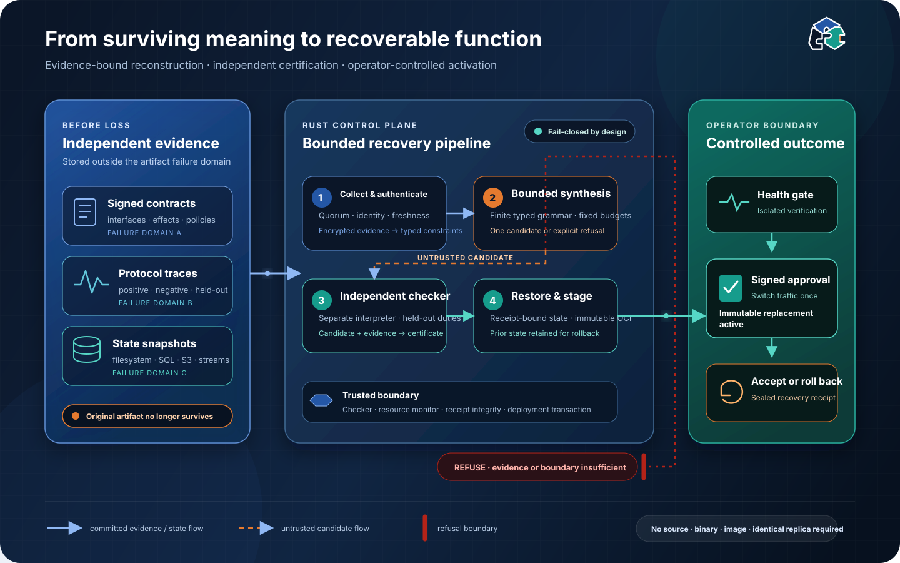

# Anasemble


**Recover a lost service component from evidence stored beyond the component's
failure domain.**

Anasemble is a Rust disaster-recovery control plane for the case ordinary
deployment artifacts do not survive. It reconstructs bounded service behaviour
from independently retained contracts and traces, verifies the candidate before
use, restores associated state, and activates an immutable replacement with an
operator-approved rollback path.

Anasemble refuses recovery when the available evidence cannot justify a safe
result. It complements backups and replication; it does not replace them.

## What Anasemble does

1. **Prepare:** sign, encrypt, and distribute executable contracts, protocol
   evidence, and state snapshots away from deployable artifacts.
2. **Reconstruct:** synthesize a replacement within a finite, typed service
   grammar after declared artifact loss.
3. **Certify:** check the candidate against independently retained positive,
   negative, and metamorphic obligations.
4. **Restore:** recover filesystem, PostgreSQL, S3-compatible, and Redis Streams
   state through receipt-bound rollback workflows.
5. **Activate:** publish an immutable OCI artifact and switch an isolated Docker
   or Kubernetes workload only after signed operator approval and health checks.
6. **Accept or roll back:** retain a sealed recovery receipt until the operator
   commits the recovery or reverses activation and restored state.

Every stage is fail-closed. Evidence, reconstructed behaviour, state, activation,
and rollback are bound by hashes and explicit receipts rather than inferred from
ambient infrastructure.



## Supported today

The current supported release-candidate profiles are deliberately narrow:

| Profile | Status | Boundary |
| --- | --- | --- |
| macOS arm64 control plane | Supported | Rust 1.97.0 and local filesystem |
| macOS arm64 state recovery | Supported | PostgreSQL 18, MinIO S3 API, and Redis Streams 8.8 on trusted loopback |
| macOS arm64 Docker activation | Supported | Docker Engine 29 on one trusted host |
| Kubernetes and integrated end-to-end recovery | Experimental | Kubernetes 1.36; production CNI enforcement is not yet validated |
| Linux arm64 and x86_64 control plane | Experimental | Clean-container evidence; x86_64 is emulated and production hosts are unverified |
| Remote PostgreSQL or Redis | Unsupported | Authenticated TLS transports are not implemented |

The authoritative [compatibility contract](docs/COMPATIBILITY.md) distinguishes
implemented, tested, supported, experimental, and unsupported combinations. A
component appearing in the matrix does not imply that every combination is
supported.

## Quick start

Build and verify the exact locked Rust dependency graph:

```console
rustup show
cargo fetch --locked
cargo build --release --locked --offline
./scripts/ci-local.sh
```

Then follow the [integrated evaluation quickstart](docs/QUICKSTART.md) to prepare
independent evidence, deliberately remove the original component and state, run
reconstruction through Kubernetes activation, and exercise rollback and
acceptance. The drill is destructive and requires disposable PostgreSQL, MinIO,
Redis, OCI registry, Docker, and kind fixtures.

For installation into an exact immutable prefix, see
[Installation and removal](docs/INSTALLATION.md). Operators should begin with the
[Disaster runbook](docs/DISASTER_RUNBOOK.md).

## Safety and scope

Anasemble is implementation-complete for the profiles marked **Supported** in
the compatibility contract. It is not arbitrary program recovery, autonomous
software creation, or a substitute for source control, backups, replication,
point-in-time recovery, object versioning, or queue durability.

The reconstructed candidate currently implements an inspectable finite-state
service contract; it does not generate a general-purpose HTTP server. Docker,
the Kubernetes control plane, credential files, operator signing keys, and the
host kernel remain inside the trusted computing base. Unsupported transports,
versions, architectures, or evidence combinations are refused rather than
silently treated as compatible.

Read the [architecture](docs/ARCHITECTURE.md), [trust and security
ledger](docs/TCB_LEDGER.md), [operations boundaries](docs/P4_OPERATIONS_AND_READINESS.md),
and [claim boundaries](docs/NOVELTY.md) before production evaluation.

## Project status

`v0.1.0-rc.1` is prepared as an Apache-2.0 public source candidate. The
repository remains private until the separate checks and approvals in the
[public opening runbook](docs/PUBLIC_OPENING.md) are complete. No package,
deployment, visibility change, tag, or GitHub Release is implied by this state.

While the repository is private, `./scripts/ci-local.sh` is the authoritative CI
gate and hosted CI is intentionally absent. Clean-clone Linux evidence is
recorded separately in the [Linux matrix](docs/LINUX_MATRIX.md).

## Documentation

- [Integrated evaluation](docs/QUICKSTART.md)
- [Compatibility matrix](docs/COMPATIBILITY.md)
- [Installation and removal](docs/INSTALLATION.md)
- [Disaster runbook](docs/DISASTER_RUNBOOK.md)
- [Architecture](docs/ARCHITECTURE.md)
- [Security policy](SECURITY.md)
- [Support policy](SUPPORT.md)
- [Research evidence and novelty boundaries](docs/NOVELTY.md)

## Contributing and licence

Contributions are welcome under the [contribution guide](CONTRIBUTING.md),
[governance model](GOVERNANCE.md), and [code of conduct](CODE_OF_CONDUCT.md).
Please report vulnerabilities through the private process in
[SECURITY.md](SECURITY.md), not a public issue.

Anasemble is licensed under the [Apache License 2.0](LICENSE). The licence does
not grant trademark rights in the Anasemble name or Semantic Fit identity; see
[TRADEMARKS.md](TRADEMARKS.md).
